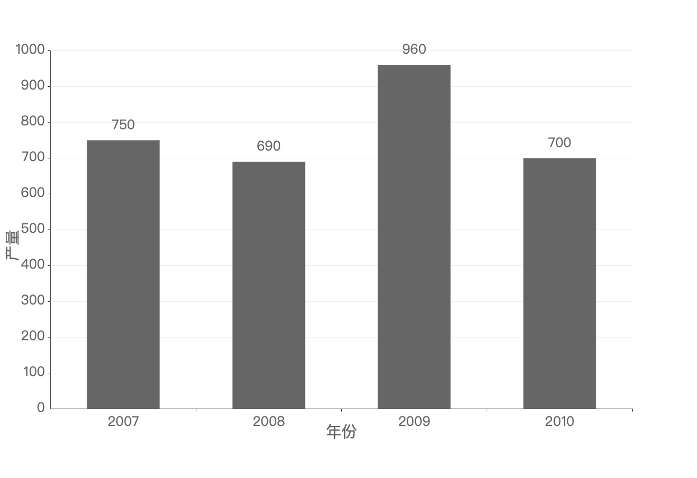

# 原生实现柱状图

## 效果



## 代码实现

### 完整实现

```html
<!DOCTYPE html>
<html lang="en">
<head>
  <meta charset="UTF-8">
  <meta name="viewport" content="width=device-width, initial-scale=1.0">
  <title>柱状图</title>
</head>
<body>
  <canvas id="cvs" width="600" height="400"></canvas>
</body>
<script>
  class BarChar {
    constructor(id) {
      this.canvas = document.getElementById(id)
      // 创建画布
      this.ctx = this.canvas.getContext('2d')

      this.setRadio()

      // 内边距
      this.cPadding = 80
      // 纵轴宽度
      this.yAxisH = this.canvas.height - this.cPadding * 2
      // 横轴宽度
      this.xAxisW = this.canvas.width - this.cPadding * 2
      // 原点的横坐标
      this.originX = this.cPadding
      // 原点的纵坐标
      this.originY = this.yAxisH + this.cPadding
      // 纵坐标的段数
      this.yAxisNum = 10
      // 横坐标的段数
      this.xAxisNum = 0

      this.data = []

      this.count = 0
    }

    init() {
      this.ctx.font = '24px Ariial';

      // 绘制坐标轴
      this.drawAxis()

      this.bindEvent()
    }

    setData(arr) {
      this.data = arr
      this.xAxisNum = arr.length
      this.init()
    }

    setRadio() {
      let device = window.devicePixelRatio || 1;
      let canDevice = this.ctx.backingStorePixelRatio || 1;
      let ratio = device / canDevice;
      let oldW = this.canvas.width,
          oldH = this.canvas.height;

      this.canvas.width = ratio * oldW;
      this.canvas.height = ratio * oldH;

      this.canvas.style.width = oldW + 'px';
      this.canvas.style.height = oldH + 'px';
    }

    drawLine(x,y,x2,y2) {
      // x, y-起始坐标，x2,y2-终点坐标
      this.ctx.beginPath()
      // 设置线的宽度1像素
      this.ctx.lineWidth = 1
      this.ctx.moveTo(x, y)
      this.ctx.lineTo(x2, y2)
      this.ctx.stroke()
      this.ctx.closePath()
    }

    drawAxis() {
      // 把canvas的坐标原点设置到0.5，0.5的位置，解决线模糊的问题
      this.ctx.translate(0.5, 0.5)
      // 定义线条颜色
      this.ctx.strokeStyle = '#333'
      // Y
      this.drawLine(this.originX, this.originY, this.originX, this.cPadding)
      // X
      this.drawLine(this.originX, this.originY, this.canvas.width - this.cPadding, this.originY)

      this.drawMarker()

      this.drawBar()

      this.ctx.translate(-0.5, -0.5)
    }

    // 画刻度
    drawMarker() {


      // 画Y轴
      let oneYVal = this.yAxisH / this.yAxisNum;
      this.ctx.textAlign = 'right';

      for(let i = 0; i <= this.yAxisNum; i++) {
        this.ctx.fillText(i * 100, this.originX - 10, this.originY - i * oneYVal + 5)
        if(i > 0) {
          this.ctx.strokeStyle = '#333'
          this.drawLine(this.originX, this.originY - i * oneYVal, this.originX - 5, this.originY - i * oneYVal)
          this.ctx.strokeStyle = '#eee'
          this.drawLine(this.originX, this.originY - i * oneYVal, this.canvas.width - this.cPadding, this.originY - i * oneYVal)
        }
      }

      this.ctx.save()
      this.ctx.font = '28px Arial'
      this.ctx.rotate(-Math.PI / 2)
      this.ctx.fillText("产量", -this.canvas.height/2, 20)
      this.ctx.restore()

      // 画X轴
      let oneXVal = this.xAxisW / this.xAxisNum
      this.ctx.strokeStyle = '#333';
      this.ctx.textAlign = 'center';

      for(let i = 0; i < this.xAxisNum; i++) {
        this.ctx.fillText(this.data[i][0], this.originX + (i + 1) * oneXVal - oneXVal / 2, this.originY + 30)
        this.drawLine(this.originX + (i + 1) * oneXVal, this.originY, this.originX + (i + 1) * oneXVal, this.originY + 5)
      }

      this.ctx.save()
      this.ctx.font = '28px Arial'
      this.ctx.fillText('年份', this.canvas.width / 2, this.originY + 50)
      this.ctx.restore()
    }

    drawRect(x,y,w,h) {
      this.ctx.beginPath()
      this.ctx.rect(x,y,w,h)

      let color = this.ctx.createLinearGradient(0,0,0, 500)
      color.addColorStop(0, '#666')
      color.addColorStop(1, '#666')

      this.ctx.fillStyle = color
      this.ctx.strokeStyle = color
      this.ctx.fill()
      this.ctx.closePath()
    }

    drawBar() {
      let oneXVal = this.xAxisW / this.xAxisNum
      let barW = oneXVal / 2

      for(let i = 0; i < this.xAxisNum; i++) {
        let barH = this.data[i][1] * this.yAxisH / 1000 * (this.count / 100);
        let y = this.originY - barH;
        let x = this.originX  + i * oneXVal + barW / 2
        this.drawRect(x, y, barW, barH)
        this.ctx.fillText(this.data[i][1], (x+barW / 2), (y - 20))
      }

      this.animateID = requestAnimationFrame(this.animate.bind(this))
    }

    animate() {
      this.count ++;
      if(this.count <= 100) {
        this.ctx.clearRect(0,0,this.canvas.width, this.canvas.height)
        this.drawAxis()
      } else {
        this.count = 100
      }
    }

    bindEvent() {
      this.canvas.addEventListener('click', () => {
        window.cancelAnimationFrame(this.animateID)
        this.ctx.clearRect(0,0,this.canvas.width, this.canvas.height)
        this.count = 0
        this.setData(this.data)
      })
    }

  }

  let bar = new BarChar('cvs')
  let data = [[2007, 750], [2008, 690], [2009, 960], [2010, 700]]
  bar.setData(data)
</script>
</html>
```
