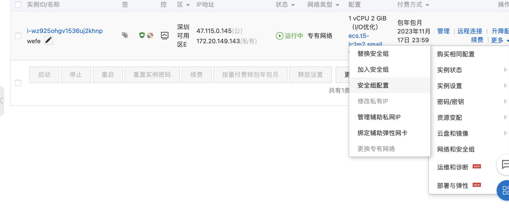
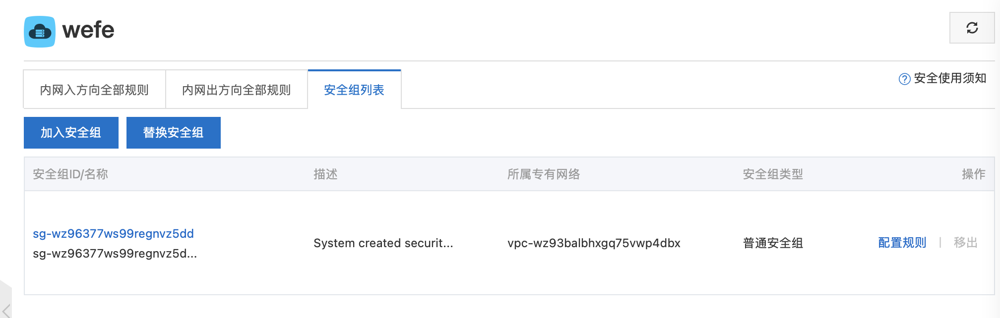
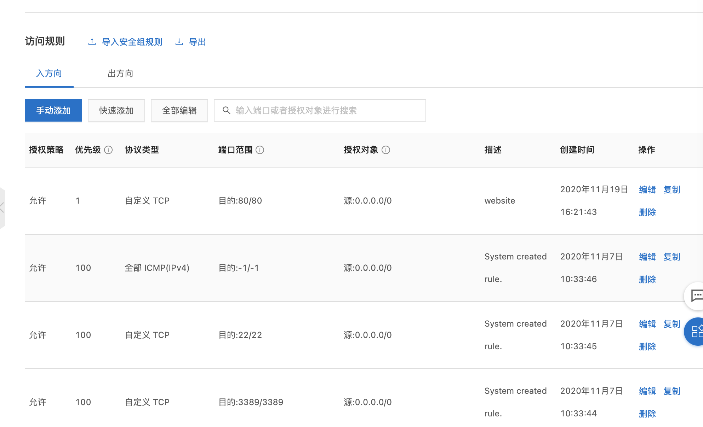

# 线上部署

## 搭建服务器环境

- [如何在CentOS 8中安装中文支持](https://help.aliyun.com/knowledge_detail/154704.html?spm=5176.11065259.1996646101.searchclickresult.6bbbddc8bybUOE)

- [手动部署LNMP环境（CentOS 8）](https://help.aliyun.com/document_detail/173042.html?spm=a2c4g.11186623.6.1196.35824d3cpvIDLa)

### 部署Node环境

- [部署Node.js环境](https://help.aliyun.com/document_detail/172788.html?spm=a2c4g.11186623.6.1206.1c4934fdSSVGql)

### 部署Nginx环境

### 部署MySQL环境

### 使用docker部署

- [部署并使用Docker（CentOS 8）](https://help.aliyun.com/document_detail/187598.html?spm=5176.13910061.sslink.59.489c401bh9Cyhp)

### 配置PM2

- <https://wohugb.gitbooks.io/pm2/content/features/quick-start.html>

## 配置安全组及规则

